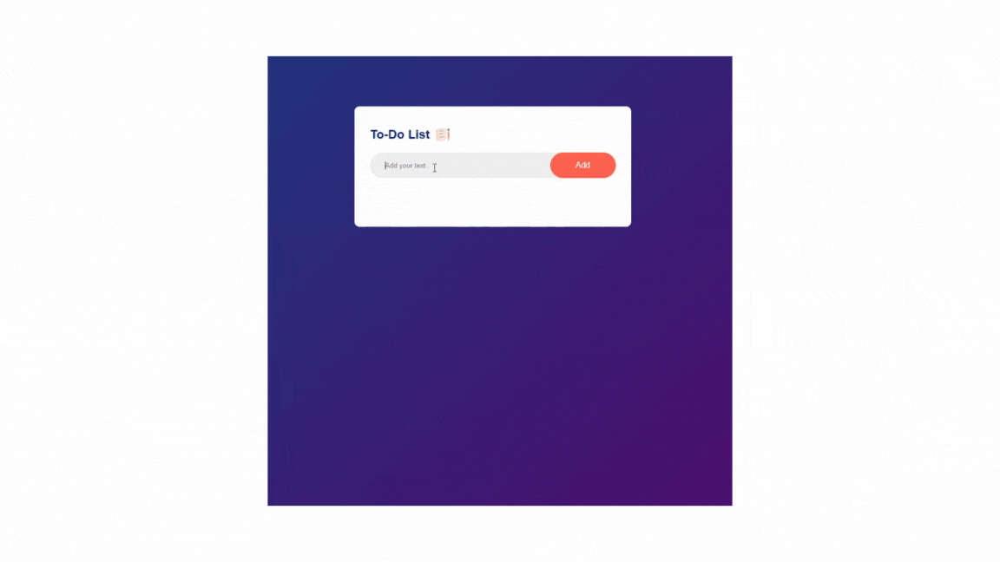

# to-do_app

<h1> <b>✅ To-Do List Project</b> </h1>

<h3>This project is a simple To-Do List designed to help users keep track of their tasks, avoid forgetting important items, and review what is left to do through a convenient checklist.</h3>

<h1> 🚀 Project Overview </h1>

<h3>During the development of this project, the following technologies were used:</h3>

<h4>
<ul> 
<li><b>HTML 📝: </b>  To build the structure of the website.</li>
<li><b>SCSS 🎨: </b> For simple and clean styling..</li>
<li><b>JavaScript ⚡:</b> To make the platform interactive and dynamic.</li>
 </ul> 
 </h4>

 <h1> <b>🔑 Key Features:</b></h1>
  
  <h4>
<ul> 
<li><b> Add tasks to the list.</b> </li>
<li><b>Mark tasks as completed.</b> </li>
<li><b> View your task list dynamically as you update it.</b> </li>
<li><b> Remove completed or unwanted tasks.</b> </li>
 </ul> 
 </h4>

<h4>
<ul> 
<li><b>HTML </b></li>
<li><b>SCSS </b> </li>
<li><b>JavaScript</b></li>
 </ul> 
 </h4>

 <h1> <b> 💻 How to Run the Project </b> </h1>

